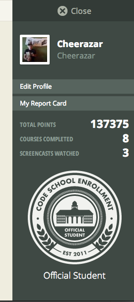
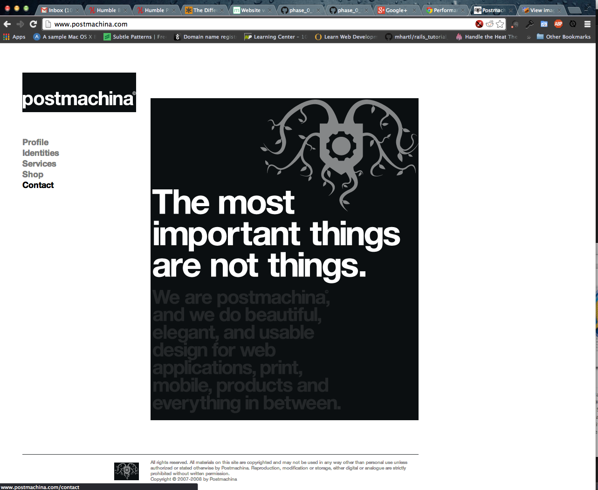

#### Include an inline screenshot of your codeschool's points from the profile page:

<!-- Modify the Markdown to include your answers. Don't delete the questions! -->

##QUIZ
* Explain which tabs support the following actions and how.
  * Realtime editing of HTML and CSS 
  * JavaScript Debugging
  * Performance Optimization

  

    The Elements and Sources sections support editing of HTML. In the Elements section you can experiment in real time with the HTML and CSS within the page that is loaded. You can edit content in the Sources section and save it in the browsers cache or you can even save a copy of it locally. Additionally you can experiment with settings in the sources tab and revert changes or discard all of your changes.  
  

  

    The Console and the Sources sections allow you to debug JavaScript. Within the console you can output information from your page using the console.log() commang. Additionally you can use the Console to type in JavaScript commands to interact with the document that is loaded and even evaluate various JavaScript expressions. 
  

  

    Performance optimizations can be discovered using the Timeline, Profiles, and Network sections. The Network section shows you whether or not elements have loaded, what file initiated their download, how big they are, how long it took them to load, and it shows a waterfall diagram of when they were loaded during the page loadout. These features can help you isolate problems like a large image that is taking long to load (might be able to shrink to decrease load time), a file not loading at all (maybe a bad html link), and files waiting until a certain event fires (could load certain parts asynchronously). These are some of the issues that might be discovered in the Network tool. . 
  

  

    The Timeline tool helps map the performance of a web page. It can assist you in seeing what is running slowly in each frame of your application. Whether it is your JavaScript, Rendering, Painting, or Loading events. Additionally you can also see how much memory your application is using, which assists in identifying memory leaks. 
  

  

    The Profiles tool can allow you to perform a JavaScript CPU Profile, which can help you isolate slower sections of your JavaScript code. It might help you find a poorly written function that takes a long time to run that can be refactored to improve performance. This tool also enables you to take a Heap Snapshot, which can help isolate memory leaks. If your page starts to operate slowly after being used for a little while, there is a chance that you have a memory leak in your code somewhere. This code can compare snapshots taken during non-activity and after activity, which can help you to isolate a leak if present. 
  

* What's the quick key for your OS to spawn the Dev Tools inspector?

Cmd(⌘)+Option(⌥)+i

* Go to http://www.postmachina.com/ and analyze and tweak this nicely designed page.
  * What is the current background color for the page?  (Surprisingly, it's not just black!)
  * Tweak the background color to white.
  * Tweak the height of the side bar that contains the logo.  Shrink it down to 85px.
  * Roll over the navigation links.  When you hover over them, they dissapear.  Let's change the hover color to black instead.
  * Now take a screenshot of your new (and maybe not so improved) design.  It should match this screenshot: http://postimg.org/image/5ak1jkpl5/
  * Upload your own image to the imgs directory in the `1_Chrome_Dev_Tools` directory.  It should match the image above. The last nav link in the image above is black because the mouse was hovering there when the screenshot was taken. Do the same, and don't take a screenshot of your whole desktop, just the browser window. (This is part of the challenge.)

  

    The current background color of postmachima is #0b0f11.
  

  
  
The new and improved postmachima!

  

* For the postmachina website, why can't you tweak the color of the text "The most important things are not things"?  Please explain.

  

    You can't edit the color of that text in the Chrome Developer Tools, due to the fact that those words are part of an image. The white of the text isn't being set by CSS, so it cannot be adjusted using this tool.
  

* Go to www.ticketswizard.com and analyze the page.  
  * What is the largest image on the website? 
  * Explain how you would find out this information, and list the URL of offending image here and how big it is.

  

    The largest image on the site is <a href="http://www.ticketswizard.com/Images/Catalog/92624182-c482-4a35-8da2-4fbf2f502e94_Large_Large.png">here</a> clocking in at 316KB. You can find what the largest image by opening the Network tool in Chrome Developer Tools, then reloading the page, and sorting the results by size in descending order. This image was the largest on and thus ended up on top of the list. 
  

* Test the www.ticketswizard.com website with google's [PageSpeed Insights](http://www.ticketswizard.com/).  (You can also download the chrome plugin).  What is the easiest thing to change to optimize the website?  How many kilobytes of data can be eliminated?

  

    One of the easiest things that could be done to optimize the website is to reduce the sizes of most images. According to <a href="https://developers.google.com/pagespeed/insights">PageSpeed Insights</a> there are a group of images that could have their total size reduced by 885.9 KiB.
  

